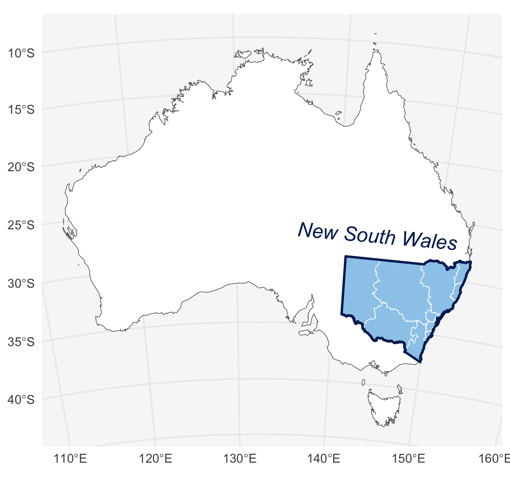

<!-- README.md is generated from README.Rmd. Please edit that file -->

# nswgeo

<!-- badges: start -->

[](https://cidm-ph.r-universe.dev)
<!-- badges: end -->

A collection of geospatial datasets and map plotting helpers for working
with New South Wales maps. The maps are registered with `{cartographer}`
and so are compatible with `{ggautomap}`.

## Installation

You can install nswgeo like so:

``` r
options(repos = c(
  cidmph = 'https://cidm-ph.r-universe.dev',
  CRAN = 'https://cloud.r-project.org'))
  
install.packages('nswgeo')
```

## Examples

The datasets you use with this package will have one column that
contains a feature name (Local Health District, Local Government Area,
or postal code). You’ll probably also have columns you want to use for
faceting and/or colouring points as in this example:

``` r
library(nswgeo)
library(ggplot2)
data(covid_cases_nsw, package = "nswgeo")

head(covid_cases_nsw)
#> # A tibble: 6 × 5
#>   postcode lga       lhd                 year type 
#>   <chr>    <chr>     <chr>              <int> <chr>
#> 1 2427     Mid-Coast Hunter New England  2022 B    
#> 2 2761     Blacktown Western Sydney      2021 A    
#> 3 2426     Mid-Coast Hunter New England  2022 B    
#> 4 2148     Blacktown Western Sydney      2022 B    
#> 5 2768     Blacktown Western Sydney      2021 A    
#> 6 2766     Blacktown Western Sydney      2021 B
```

Using `{cartographer}`, this can be converted into a spatial data frame.

Alternatively, `{ggautomap}` can take such a data frame and plot maps
directly. For some recipes and examples, see the vignette in the
`{ggautomap}` package.

The data can also be used directly with ggplot:

``` r
ggplot(nswgeo::lhd) + geom_sf()
```


